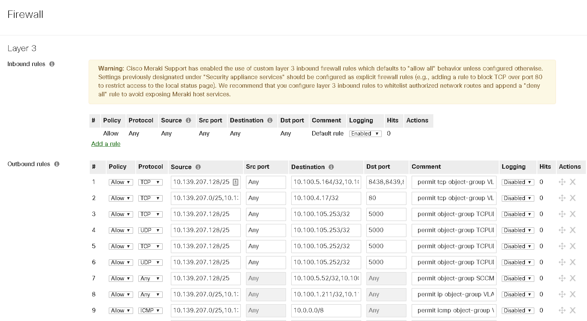
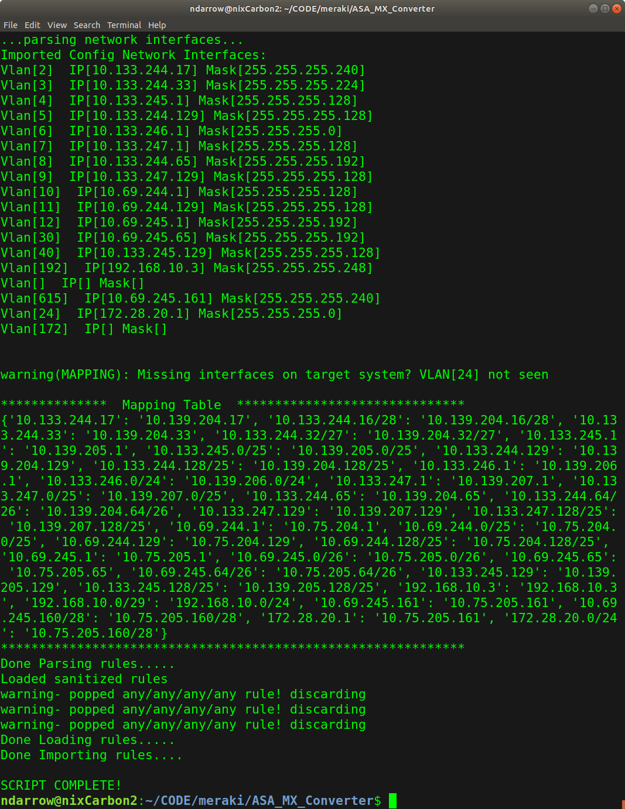

# Meraki MX Converter
Meraki MX Converter - Import ASA config files and automatically adapt rules to the target MX. This script will parse through an existing ASA config and generate Meraki MX compatible FW rules. The script supports objects(network/service). It'll build iterative or multi-source/multi-destination L3 based rules. It'll then configure the target MX network with the ruleset mapping to the new interfaces.

# Steps
1. place config files in local directory (raw output from 'show run' on the ASA)
2. Create a new MX network in the Meraki Dashboard
3. Create interfaces (vlan, ip and subnet) in that new network (these should match interfaces VLAN-ID in the config file)
4. For step#3, the IP/subnets do not have to match, just the VLAN-ID. The script will auto-map the new IP/subnet to the ruleset
5. Edit "acl_list.txt" this file should contain the names of every ACL rule you want to process
6. RUN THIS ON A TEST NETWORK FIRST! This re-writes ALL the rules and anything currently in the rules will be lost.
7. Run the commandline "python3 mx_import.py -k \<key\> -o \<org\> -n \<networkID\> -c command \<ASA CONFIG FILE\>"
  -commands supported "write", "clear" and "test". Test is default. Clear will wipe the FW rules.
8. After the script runs, validate the rules have ported correctly. The comments section will hold the original ACL rule to compare

# Requirements
1. python 3.x
2. meraki SDK for python (https://developer.cisco.com/meraki/api/#/python/getting-started)
3. misc python libraries

# Known caveats:
-limitations on source addresses rules, you can only import a rule if the source address/subnet exists on the target MX. The script will omit subnets for which it doesn't have a local interface or default route.
-test it first

# Example Output

